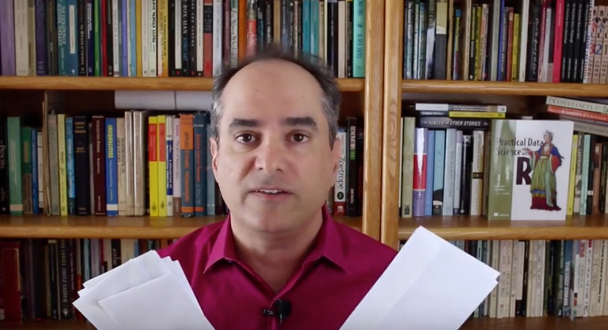

# CampaignPlanner_v3

Shiny demo of A/B test planning and evaluation

Improved user interface for A/B testing theory taught in this
free video course [Bayesian A/B campaign testing (and design)](https://www.youtube.com/playlist?list=PLAKBwakacHbRRw278HMXpCsOOIIcLYGX5).

Also available as a [public running app](https://www.youtube.com/playlist?list=PLAKBwakacHbRRw278HMXpCsOOIIcL).

#  [Win-Vector LLC's free  video lecture on Bayesian A/B testing](https://www.youtube.com/playlist?list=PLAKBwakacHbRRw278HMXpCsOOIIcLYGX5)

Source code: https://github.com/WinVector/CampaignPlanner/
App hosted online at: https://win-vector.shinyapps.io/CampaignPlanner/

Newer (better) online app: https://win-vector.shinyapps.io/CampaignPlanner_v3/
Newer (better) source code: https://github.com/WinVector/CampaignPlanner_v3/

The course emphasizes how to design A/B tests using prior "guestimates" of effect sizes (often you have these from prior campaigns, or somebody claims an effect size and it is merely your job to confirm it) using Bayesian tools.

The solution is coded in R and Nina Zumel has contributed an updated Shiny user interface demonstrating the technique.

This sort of fills out our survey of ways to think about A/B testing:

 * Classic frequentist theory: emphasizes correct decision over expected returns/value. http://www.win-vector.com/blog/2014/05/a-clear-picture-of-power-and-significance-in-ab-tests/
 * Bandit Formulations: great utility theory based solution to the problem. http://www.win-vector.com/blog/2014/04/bandit-formulations-for-ab-tests-some-intuition/
 * Dynamic programming methods: more involved tracking of utility. http://www.win-vector.com/blog/2015/07/dynamic-prog-ab-test-design/
 * Sequential analysis: operationalizing many of the above ideas. http://www.win-vector.com/blog/2015/12/sequential-analysis/
 * Bayesian methods: correct distribution inference for individual test runs. (this course/playlist).

See here for another survey of our on the topic: http://www.win-vector.com/blog/2015/06/designing-ab-tests/

